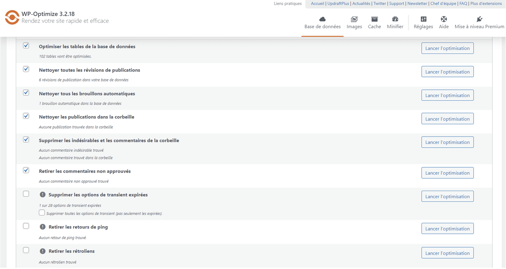
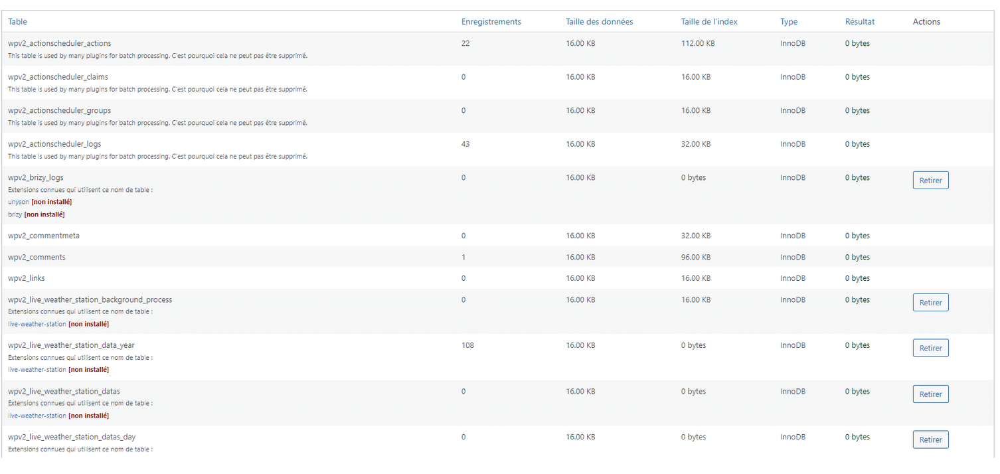

# WP-Optimize

WP-Optimize is a WordPress plugin designed to optimize and clean up your WordPress database.

It can perform tasks such as removing post revisions, drafts, spam comments, and expired transients. Additionally, it offers database optimization and table repairs to improve your site's performance.

:::note
Documentation for [WP-Optimize here](https://wordpress.org/plugins/wp-optimize/)
:::

## What Are the Features of WP-Optimize?

Let's take a closer look at what WP-Optimize has to offer. Below, I’ll present the features of WP-Optimize so you know what to expect from this plugin.

### Database Cleanup

We won’t waste any time and dive straight into cleaning the WordPress database. This is a task that carries some risk, so I recommend backing up your site before proceeding.

After installing WP-Optimize, head to the Database section. WP-Optimize offers numerous options as shown in the image below:

WP-Optimize has some default settings checked. If you don’t want to take risks, I suggest following these recommendations. In most cases, the default settings will suffice:

- Optimize database tables
- Clean all post revisions
- Clean all auto-drafts
- Etc.

However, you can select additional cleanup options if you wish:

- Remove expired transient options
- Remove pingbacks
- Remove trackbacks
- Clean post or comment metadata
- Clean orphaned relationship data

Be cautious with these settings. In the event of a bug or unexpected server crash during optimization, your data could become corrupted, which could be a major hassle.

Once you have selected the settings you’re interested in, simply click the button to Run all selected optimizations.

### SQL Table Cleanup

The same goes for SQL tables. You can clean them to free up disk space and improve your site's performance. Again, I recommend backing up beforehand to ensure peace of mind.

As you can see, WP-Optimize displays for each table the number of records, data size, index size, etc.

It also lists plugins that use each table. This is where you often notice that plugins uninstalled a while ago still leave traces and occupy space.

WP-Optimize will indicate if a plugin is unused to help you clean up tables properly.

Also WP-Optimize will tell you, in some cases, that the tables are made with MyISAM. You should convert them into InnoDB ones, you just have to click on the button.
