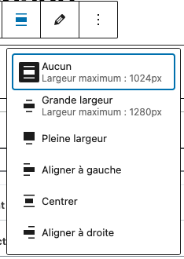

# Using the theme.json

The `theme.json` file is a powerful configuration file introduced in WordPress 5.8 that allows theme developers to control various aspects of their theme's appearance and functionality.

It serves as a central configuration point for global styles, block settings, and custom templates.

This file helps maintain consistency across your theme and provides a more structured way to manage theme settings compared to traditional methods.

> **Best Practice**: It's highly recommended to define your `theme.json` configuration at the start of your theme development project.

While it's possible to modify it later, changing the configuration mid-project can lead to inconsistencies and require additional work to maintain the theme's design system.

A well-planned `theme.json` file from the beginning helps ensure a consistent design language throughout your theme and makes it easier to maintain and update in the future.

## Naming Conventions for Variables

To ensure clarity, scalability, and maintainability in your theme, it's important to follow a consistent naming convention for all your design tokens (colors, spacing, etc.) in `theme.json`.

Here is a recommended table of patterns:

| Category         | Example Slugs                                      | Notes                                      |
| ---------------- | -------------------------------------------------- | ------------------------------------------ |
| Colors: Contrast | contrast-1, contrast-1-dark, contrast-2, ...       | Use for text and elements needing contrast |
| Colors: Base     | base-1, base-1-dark, base-2, ...                   | Use for backgrounds and surfaces           |
| Colors: Accent   | accent-1, accent-1-dark, accent-2, ...             | Use for highlights, buttons, links, etc.   |
| Colors: Other    | white, black, error, success, warning, info, ...   | Brand, state, or utility colors            |
| Font Families    | title, text                                        | Use for font family presets                |
| Border Radius    | xs, sm, base, medium, large, extra-large, 2xl, 3xl | Use for border-radius presets              |
| Shadows          | xs, sm, base, medium, large, extra-large, 2xl, 3xl | Use for shadow presets                     |
| Spacing          | xs, sm, base, medium, large, extra-large, 2xl, 3xl | Use for spacing presets                    |
| Font Sizes       | xs, sm, base, medium, large, extra-large, 2xl, 3xl | Use for font size presets                  |

> **Tip:** Use lowercase and hyphens for multi-part names (e.g., `contrast-1-dark`). This keeps your variables readable and consistent.

If all your variables follow these naming conventions, blocks that use these variables will automatically adapt to the new theme's design system when moved from one theme to another.

This means you can reuse blocks across projects or themes without having to manually update their styles.

## Disabling Editor Features

The `theme.json` file allows you to control which features are available in the WordPress editor.

This is particularly useful for maintaining design consistency and preventing users from making potentially problematic style choices. Here's how to disable specific features:

```json
{
  "settings": {
    "color": {
      "customGradient": false,
      "defaultGradients": false
    }
  }
}
```

In this example:

- `customGradient` disables all the possibility to create custom gradients in the editor.
- `defaultGradients` disables the ability to use Wordpress default gradients.

You can selectively enable or disable these features based on your theme's requirements and the level of customization you want to allow for users.

## Color Definition

> **Best Practice:** Organizing your color palette into base, contrast, and accent colors is recommended for clarity, maintainability, and accessibility.

This structure helps ensure your theme is visually coherent and easy to adapt for features like dark mode.
>
> - **Base colors** are used for primary backgrounds and surfaces. They provide the foundation for your theme's look and should be chosen for readability and subtlety.
> - **Contrast colors** are used for text and elements that need to stand out against base colors, ensuring sufficient contrast for accessibility.
> - **Accent colors** are used for highlights, buttons, links, and interactive elements. They bring vibrancy and brand identity to your theme, and should remain consistent even in dark mode.
> - **Each color should be unique.**

The `theme.json` file allows you to define a consistent color palette for your theme. Here's how to set up colors with base, contrast, and accent colors:

```json
{
  "settings": {
    "color": {
      "palette": [
        {"slug": "white", "color": "#ffffff", "name": "White"},
        {"slug": "black", "color": "#000000", "name": "Black"},
        {"slug": "base-1", "color": "#fffffe", "name": "Base 1"},
        {"slug": "base-2", "color": "#f5f5f5", "name": "Base 2"},
        {"slug": "contrast-1", "color": "#1a1a1a", "name": "Contrast 1"},
        {"slug": "contrast-2", "color": "#333333", "name": "Contrast 2"},
        {"slug": "accent-1", "color": "#0073aa", "name": "Accent 1"},
        {"slug": "accent-2", "color": "#005177", "name": "Accent 2"}
      ]
    }
  }
}
```

> **Note about Dark Mode**: When implementing dark mode, only the base and contrast colors should be modified to maintain proper contrast and readability.

Accent colors should remain consistent across both light and dark modes to maintain brand identity and visual consistency.

### Using Color Variables

You can use these color variables in your theme's CSS using the `var()` function. WordPress automatically generates CSS variables for all colors defined in your palette:

```css
.my-element {
  /* Using base colors */
  background-color: var(--wp--preset--color--base-1);
  color: var(--wp--preset--color--base-2);

  /* Using contrast colors */
  border-color: var(--wp--preset--color--contrast-1);

  /* Using accent colors */
  background-color: var(--wp--preset--color--accent-1);
}
```

You can also use these variables in your block styles

## Layout and Spacing Options

You can control your theme's layout and spacing using the `theme.json` file. This includes settings for content width, wide width, margin, padding, spacing units, and more.

For a comprehensive guide, see: [Theme.json layout and spacing options](https://fullsiteediting.com/lessons/theme-json-layout-and-spacing-options/)

### Layout Settings

Define your theme's layout sizes and constraints:

```json
{
  "settings": {
    "layout": {
      "contentSize": "1024px",
      "wideSize": "1280px"
    }
  }
}
```

> **Note:** These variables are used by the WordPress Gutenberg editor to control the available width options for blocks.

They determine the maximum width for "None" (content size), "Wide width" (grande largeur), and "Full width" (pleine largeur) alignments in the block settings.

#### Layout Size Options in Gutenberg

Below is an example of how these settings appear in the editor:



This menu allows users to select between different width options for blocks, as defined by your `theme.json` configuration.

#### Using Layout Size CSS Variables

When you define `contentSize` and `wideSize` in your `theme.json`, WordPress automatically generates the following CSS variables:

- `--wp--style--global--content-size`: corresponds to the value of `contentSize`
- `--wp--style--global--wide-size`: corresponds to the value of `wideSize`

You can use these variables in your custom CSS to ensure your styles are consistent with the editor's layout settings. For example:

```css
.my-custom-container {
  max-width: var(--wp--style--global--content-size);
}

.my-custom-container--wide {
  max-width: var(--wp--style--global--wide-size);
}
```

This ensures that your custom elements align perfectly with the block editor's width options, maintaining a cohesive layout throughout your theme.

### Spacing Settings

Spacing options allow you to define margin, padding, spacing units, and spacing scales for your theme:

```json
{
  "settings": {
    "spacing": {
      "units": ["px", "em", "rem", "%", "vh", "vw"],
      "customSpacingSize": true,
      "spacingSizes": [
        {"slug": "small", "size": "1rem", "name": "Small"},
        {"slug": "medium", "size": "2rem", "name": "Medium"}
      ],
      "margin": true,
      "padding": true
    }
  }
}
```

You can use these spacing variables in your CSS and block styles, just like color and layout variables.

For more advanced options, refer to the [Theme.json layout and spacing options](https://fullsiteediting.com/lessons/theme-json-layout-and-spacing-options/) documentation.

### Using Spacing and Shadow Variables in CSS

You can use the spacing and shadow variables defined in your `theme.json` directly in your CSS to ensure consistency across your theme.

#### Spacing Example

```css
.section {
  padding: var(--wp--preset--spacing--medium);
  margin-bottom: var(--wp--preset--spacing--small);
}
```

#### Shadow Example

```css
.card {
  box-shadow: var(--wp--preset--shadow--shadow-1);
}
```

These variables are automatically generated by WordPress based on your `theme.json` configuration, making it easy to maintain a consistent design system throughout your theme.

### Using Font Size Variables in CSS

You can use the font size variables defined in your `theme.json` directly in your CSS for consistent typography across your theme.

```css
h2 {
  font-size: var(--wp--preset--font-size--large);
}

.small-text {
  font-size: var(--wp--preset--font-size--small);
}
```

## Typography and Fonts

The `theme.json` file allows you to define global and block-specific typography settings, including font families and font sizes.

This helps maintain a consistent typographic system across your theme and gives users easy access to your chosen presets in the block editor.

### Font Families

You can register font families in the `settings.typography.fontFamilies` array. Each font family can include a name, slug, and the CSS font-family value.

You can also use the `fontFace` property to load custom web fonts, including Google Fonts, directly from your theme.

Example:

```json
{
  "settings": {
    "typography": {
      "fontFamilies": [
        {
          "fontFamily": "\"Source Serif Pro\", serif",
          "name": "Source Serif Pro",
          "slug": "source-serif-pro",
          "fontFace": [
            {
              "fontFamily": "Source Serif Pro",
              "fontWeight": "400 700",
              "fontStyle": "normal",
              "src": ["file:./assets/fonts/SourceSerifPro-regular.woff2"]
            }
          ]
        }
      ]
    }
  }
}
```

You can then use these font families in your styles by referencing the generated CSS variable:

```css
body {
  font-family: var(--wp--preset--font-family--source-serif-pro);
}
```

You can also assign font families to specific blocks or elements in the `styles` section of your theme.

For more details and advanced options, see:

- [Theme.json Typography Options](https://fullsiteediting.com/lessons/theme-json-typography-options/)

### Font Sizes

Font sizes can be defined in the `settings.typography.fontSizes` array. Each size includes a name, slug, and value. These sizes are available in the block editor and can be referenced in your CSS.

Example:

```json
{
  "settings": {
    "typography": {
      "fontSizes": [
        {"slug": "small", "size": "0.875rem", "name": "Small"},
        {"slug": "large", "size": "2.25rem", "name": "Large"}
      ]
    }
  }
}
```

You can use these font sizes in your CSS:

```css
h1 {
  font-size: var(--wp--preset--font-size--large);
}
```

You can also apply font sizes to specific blocks or elements in the `styles` section.

For more information and best practices, see:

- [Theme.json Font Size](https://fullsiteediting.com/lessons/theme-json-font-size/)

## Custom Parameters

The `custom` parameter allows you to define custom CSS variables that can be used throughout your theme.

This is particularly useful for values that need to be reused across different components or for properties that aren't covered by the standard theme.json settings:

```json
{
  "settings": {
    "custom": {
      "clip-path-card": "polygon(0 0, calc(100% - 30px) 0, 100% 30px, 100% 100%, 0 100%)",
      "clip-path-title": "polygon(0 0,0 0,calc(100% - 10px) 0,100% 10px,100% 100%,100% 100%,0 100%,0 100%)",
      "border-radius-sm": "2px",
      "border-radius-base": "4px",
      "border-radius-md": "6px",
      "border-radius-lg": "8px",
      "border-radius-xl": "12px",
      "border-radius-2xl": "16px",
      "border-radius-3xl": "24px"
    }
  }
}
```

### Using Custom Parameters in CSS

You can use custom parameters defined in your `theme.json` as CSS variables throughout your theme. For example, if you have a custom border radius parameter:

```css
.card {
  border-radius: var(--wp--custom--border-radius-sm);
}
```

## Conclusion

The `theme.json` file is a powerful tool for WordPress theme developers, enabling you to define, manage, and enforce a consistent design system across your site.

By leveraging its settings for colors, typography, layout, spacing, shadows, custom parameters, block styles, and elements, you can create highly customizable and maintainable themes.

These themes provide a great editing experience for users.

As WordPress continues to evolve, mastering `theme.json` will be essential for modern theme development.

## Additional Links

- [How to filter theme.json with PHP](https://fullsiteediting.com/lessons/how-to-filter-theme-json-with-php/)
- [WordPress Developer Handbook: Global Settings and Styles](https://developer.wordpress.org/themes/global-settings-and-styles/)
- [Full Site Editing: Global Styles](https://fullsiteediting.com/lessons/global-styles/)
- [WordPress.com Blog: Custom Block Styles](https://wordpress.com/blog/2025/05/07/custom-block-styles/)
