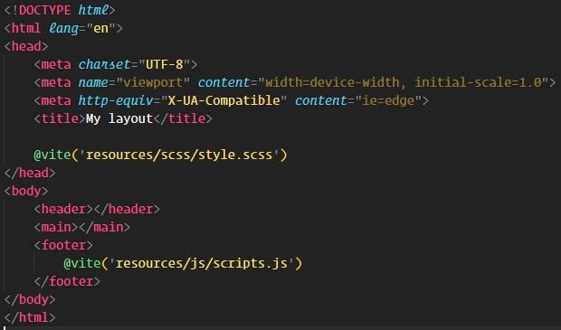

# 💦 Vite (config front exemple Laravel)

## Configuration

1. Copier les fichiers du dossier à la racine du projet (excepté le README.md)

2. Lancer la commande :

   ```bash
   npm install
   ```

3. Vérifier que l'appel des fichiers dans la blade "layout" est bien effectué (exemple ci-dessous)

   

4. Afin de bénéficier du Hot Module Replacement, veuiller renseigner une url dans le fichier .env du projet

## Commandes

- **Compilation globale**

  - **Watcher**

    - Compile le scss au moindre changement

    - Compile le js au moindre changement
  
    - Recharge le navigateur à la fin de chaque compilation

    - ```bash
      npm run watch
      ```

  - **Production**

    - **Compile & minifie** les fichiers du type renseignés dans la ligne de commande (si aucun type de fichier n'est renseigné tous les assets seront compilés)

    - ```bash
      npm run prod:{scss|js}
      ```

  - **Lint**

    - Lint les fichiers du type renseignés dans la ligne de commande

    - ```bash
      npm run lint:{scss|js}
      ```

  - **Prettier**

    - Lint les fichiers du type renseignés dans la ligne de commande

    - ```bash
      npm run prettier:{scss|js}
      ```

  - **Build**

    - Lance un lint sur le scss

    - Lance un prettier sur le scss
  
    - Lance un lint sur le js

    - Lance un prettier sur le js
  
    - Compile le scss en un fichier css minifié
  
    - Compile le js en un fichier minifié
  
    - ```bash
      npm run build
      ```


## Liste des fonctionnalités du compilateur

- Style lint
- ES lint
- Prettier
- Hot reload/refresh
- Compilation JS
- Compilation SCSS
