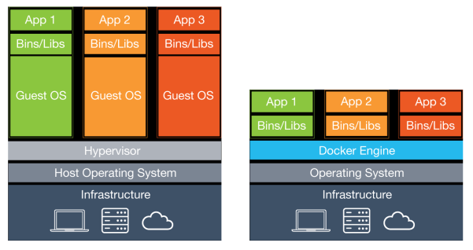
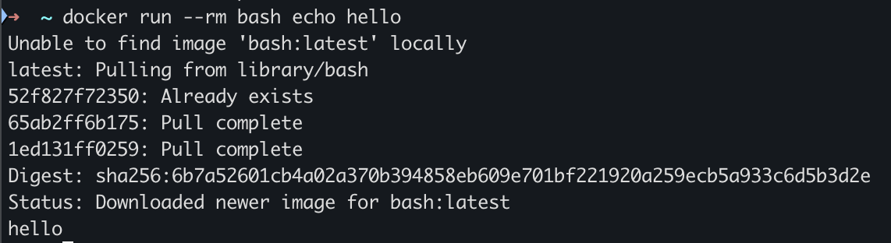
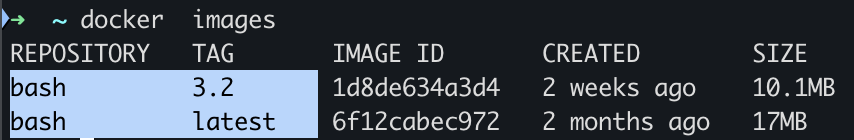
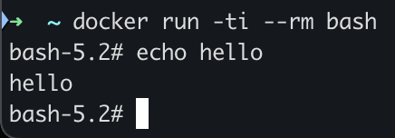
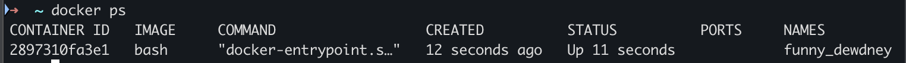
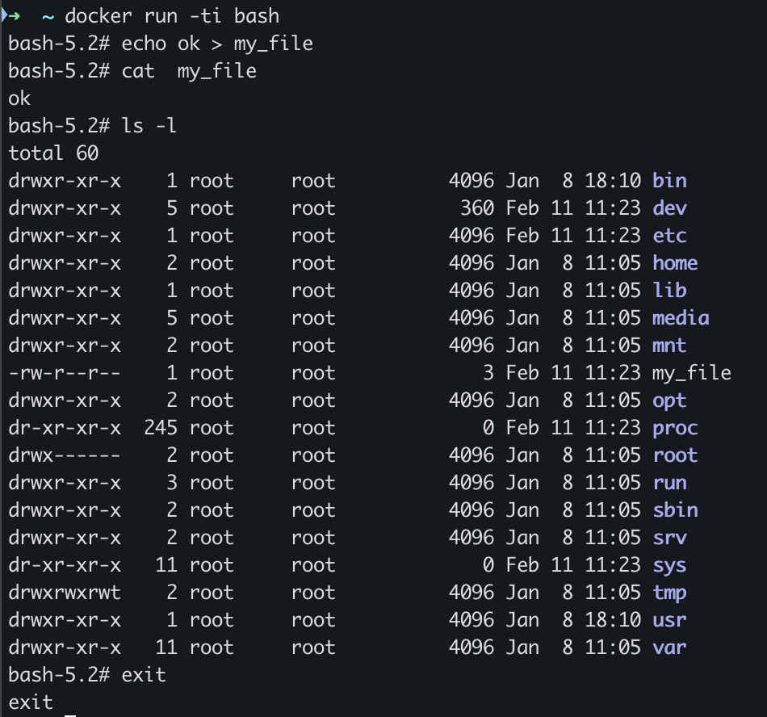
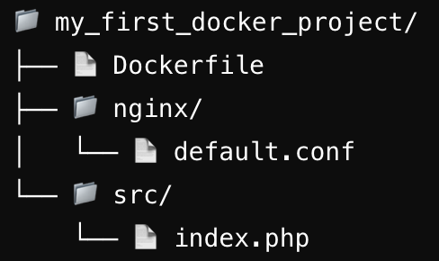

# Docker and Docker Composer

:::tip
**Quick Reference:** For a quick reference of Docker commands, see the [Docker Cheat Sheet](../development-environment/dev-toolkit/docker-cheat-sheet.md).
:::

## Pre-requisites


Docker Desktop must be installed on your machine.

If this is not the case, follow the installation guide at: [https://www.docker.com/products/docker-desktop/](https://www.docker.com/products/docker-desktop/)

then you can check the installation by running the following command:

```bash
docker --version
```
it should return the version of docker installed on your machine. exemple: 
```bash
Docker version 27.3.1, build ce12230
```

you can also check the version of docker-compose installed on your machine by running the following command:

```bash
docker-compose --version
```

it should return the version of docker-compose installed on your machine. exemple: 
```bash
Docker Compose version v2.30.3-desktop.1
```

## Key Advantages of Containers Over Virtual Machines


Unlike virtual machines (VMs), a container does not have its own operating system (OS). It uses the host's OS.

The container is an isolated process on the host machine, with no access to other processes.

Software version conflicts (e.g., MySQL 5 & 8, PHP 5 & 7) are avoided thanks to container isolation.

### Advantages of containers:
- Lower consumption of CPU, RAM, and disk (unlike VMs, which allocate fixed resources).
- More containers can be created than VMs, reducing hardware costs.
- Fast deployment: a container starts in just a few seconds, as there is no OS to boot.


## Images and Containers

Docker relies on two essential concepts: images and containers.

### Images
Docker image is a model or recipe for building containers that run applications consistently across different environments.

A Docker image is a template, that contains everything an application needs to run: its code, libraries, dependencies, and even the runtime environment.

It's a lightweight, read-only file that serves as the base to create Docker containers.

### Containers

Think of a Docker container as a "package" for your application, and the image is what defines what goes inside that package.

When you want to deploy your app, you use the image to create a container that works the same way, no matter where it's running (on your computer, a server, or in the cloud).

You can find official images provided by trusted sources, such as software here: [https://hub.docker.com/](https://hub.docker.com/)

## Exercice To Understand Docker

### Run a basic container

Run the following command to create a container from the official `bash` image:

```bash
docker run --rm bash echo hello
```

The `docker run` command creates a container from an image. The `--rm` flag removes the container after it stops running.

The `bash` specifies the image to use ([bash image on Docker Hub](https://hub.docker.com/_/bash)). The `echo hello` part is the command to run inside the container.

#### The output:



First of all, a line indicates: "unable to find image 'bash:latest' locally." Docker is looking for an image "bash" to create the container.

Docker is looking for this bash image locally on our machine.

Of course, since this is the first time we're using this image, it is not yet present on our machine or in its cache.

We now move on to the second line: "Latest pulling from library bash." Docker decides to fetch the image.

Bash, which is of course available on the Docker Hub registry. It performs a "pull" – "pull" meaning to retrieve. It pulls the image from Docker Hub to our machine.

You'll notice the word "latest" at the beginning of the line.

Then we have three lines with "pool complete." So, the pull.

The process of retrieving them from the server happens in several steps, and there is a hexadecimal value in front.

But we won't focus on that. Just like the next part of the line. The digest is the same; we'll skip over that for now.

Then we have a line that says: "status: Downloaded newer image for bash:latest." At this point, the image is now on our machine in the cache of our server.

Docker will finally be able to use it to create the container. And it executes "echo", producing the expected result, which is the display of "hello."

#### Specify a version

you can see the list of available versions on the Docker Hub page: [https://hub.docker.com/_/bash](https://hub.docker.com/_/bash)

You can specify a version when running the container.

For example, to use version 3.2 of the `bash` image, run the following command:

```bash
docker run --rm bash:3.2 echo hello
```

if you want to see the list of images on your machine, you can run the following command:

```bash
docker images
```



We can now see that we have two versions of Bash image, the latest and 3.2

:::warning
this is the images that are available on your machine, not the containers
:::


### Connect to the container (interactive mode)

To connect to a container in interactive mode, run the following command:

```bash
docker run --rm -it bash
```

`-ti` is a combination of two options in the docker run command:
- `-t`: This option allocates a pseudo-TTY (terminal) for the container. It provides a terminal interface, allowing you to interact with the container.

- `-i`: This stands for "interactive". It keeps the standard input (stdin) open, so you can interact with the container by typing commands.
  


To view your containers running on your machine, you can run the following command:

```bash
docker ps
```



### Preserve the data and the container

first we will create a file in the container, then we will exit the container and run it again to see if the file is still there.

:::tip
note that for the following commands, you need to keep the container, so you should remove the `--rm` flag from the command
:::

```bash
docker run -ti bash
```

then create a file in the container:

```bash
echo ok > my_file
cat my_file
ls -l
```

then exit the container:

```bash
exit
```




then run the container again:

```bash
docker run -ti bash
```

then check if the file is still there:

```bash
cat my_file
```

The file no longer exists. 

to understand why let see our containers:

:::tip
You can run `docker ps --help` to see the list of available options
:::

```bash
docker  ps -a
```

the `-a` option is used to show all containers (running and stopped)

When using Docker Run, a new container is always created.

#### Connect to an existing container

:::tip
you can see the list of command by double tap on the tab key after typing the first part of the command `docker [tab][tab]`
:::
to reconnect to the container, you can use the following command:

```bash
docker start -ai <container_id>
```
the container id is the first column in the output of the `docker ps -a` command

:::tip
you can see more information about the start command with `docker start --help`
:::

Now you can see that if you connect to the correct container you will find the file you created.

### The network

What you need to know is that, due to the principle of isolation, a container can open communication ports. However, by default, it remains local to the local container.

let's create a nginx container

```bash
docker run --rm nginx
```

Nginx has opened port 80 local to the container but not accessible from outside the container.

to expose the port 80 of the container to the host, you can use the `-p` option:

```bash
docker run --rm -p 8084:80 nginx   
```

the `-p` option is used to map the port of the container to the host. in this case, the port 80 of the container is mapped to the port 8084 of the host.

you can now access the nginx server by going to the following url: [http://localhost:8084](http://localhost:8084)

:::warning
A port can only be opened once.
:::

:::tip 
you can use the `-d` option to run the container in the background
:::

## Exercice to understand a Dockerfile

first create directories and files like this:




### Dockerfile

A Dockerfile is a text file that contains a set of instructions to build a Docker image. It is used to automate the process of creating a Docker image.

Create a file named `Dockerfile` in the root directory of your project and add the following content:

```Dockerfile
# Step 1: Choose a base image with PHP
FROM php:8.2-fpm

# Step 2: Install Nginx and other dependencies
RUN apt-get update && apt-get install -y nginx
RUN docker-php-ext-install pdo_mysql

# Step 3: Copy Nginx configuration file
COPY ["nginx/default.conf", "/etc/nginx/sites-enabled/default"]

# Step 4: Copy application code into the container
COPY ["src/", "/var/www/html/"]

# Step 6: Start Nginx and PHP-FPM
CMD ["sh", "-c", "php-fpm & nginx -g 'daemon off;'"]
```


### Php and Nginx configuration file


Inside the `src/index.php`. add

```php
<?php
phpinfo();
?>
```

Inside the `nginx/default.conf`, add the following Nginx configuration:
```nginx
upstream php-upstream {
    server localhost:9000;
}

server {
	listen 80;

	root /var/www/html;
	index index.php index.html index.htm;

	location ~ \.php$ {
        fastcgi_pass php-upstream;
        fastcgi_split_path_info ^(.+\.php)(/.*)$;
        include fastcgi_params;
        fastcgi_param SCRIPT_FILENAME $document_root$fastcgi_script_name;
        fastcgi_param PATH_INFO $fastcgi_path_info;
        fastcgi_param HTTPS off;
        client_max_body_size 200M;
        fastcgi_read_timeout 600;
	}

	location / {
    	try_files $uri $uri/ =404;
	}

}
```

### build the image

To create a Docker image from the Dockerfile, you need to build it. Run the following command:

```bash
docker build -t my_php_nginx_image .
```

The `-t` option is used to tag the image with a name. In this case, the image is tagged as `my_php_nginx_image`.

the `.` at the end of the command is the path to the Dockerfile. if the Dockerfile is in the current directory, you can use `.`

:::tip
you can see more information about the build command with `docker build --help`
:::

### Run the Docker container

then start the container:

```bash
docker run -p 8086:80 my_php_nginx_image
```

Access the application:

[http://localhost:8086](http://localhost:8086)

## Docker Compose

Docker Compose is a tool that allows you to manage multiple Docker containers at the same time.

It is especially useful when you need to orchestrate an application made up of multiple services, such as an API, a database, and a web server.

Instead of running each container individually using docker run commands, Docker Compose enables you to define and manage all services in a single file called docker-compose.yml.

### Why Use Docker Compose?
 
#### 1. Easier Management of Multiple Containers

A modern application often consists of multiple services: a database, a backend server, a web server, etc.

Docker Compose allows you to start and stop all of them with a single command.

#### 2. Fast and Consistent Deployment

With the docker-compose.yml file, the development environment is reproducible and can be easily shared with other developers.

#### 3. Simplified Configuration

Instead of using multiple Docker commands, you can centralize everything in a single YAML file, making configuration easier to read and manage.

#### 4. Service Isolation

Each service runs in its own container, preventing dependency conflicts between applications.

#### 5. Compatibility with Multiple Environments

You can use Docker Compose for development, testing, and even production.


## Exercice to understand Docker Compose

let's create a simple docker-compose file to run a php and nginx container

```yaml
services:
  app:
    build:
      context: .
      dockerfile: ./Dockerfile
    image: "devops/my-app:1.0.0"
    restart: unless-stopped
    ports:
      - "8087:80"
    volumes:
      - ./src:/var/www/html
    networks:
      - my-network
networks:
  my-network:
    driver: bridge
```

on this file you tell docker what to do, same as when you run the `docker build` and `docker run` commands.

for exemple `volume:` is used to mount the `src` directory to the `/var/www/html` directory in the container. same as the `-v` option in the `docker run` command.

:::tip
in docker volume is used to have the same folder in the host and the container, so if you change a file in the host it will be changed in the container and vice versa.
:::

the `networks:` option is used to create a network that will be used by the container.

:::tip
the network is used to allow the containers to communicate with each other, by default the containers are isolated from each other.
:::


### add mariadb

try by yourself to add a mariadb container to the docker-compose file.


### **Correction**

Simply add this in the services section on the docker-compose.yml

```yml
mariadb:
    image: mariadb
    restart: unless-stopped
    environment:
    MYSQL_ROOT_PASSWORD: "root"
    MYSQL_DATABASE: "my_db"
    ports:
    - "3333:3306"
    networks:
    - my-network
```

Note that in your app the host of the database is the name of the container mariadb in our example.

## conclusion

Docker is a powerful tool that allows you to create, deploy, and run applications in containers.

It simplifies the process of building, shipping, and running applications, making it easier to manage multiple services and environments.

Docker Compose is a valuable tool for managing multiple containers at the same time.

It simplifies the process of defining and running multi-container Docker applications, making it easier to manage complex applications.

By using Docker and Docker Compose, you can create a consistent and reproducible development environment, making it easier to share and collaborate with other developers.

feel free to experiment with Docker and Docker Compose to get a better understanding of how they work.