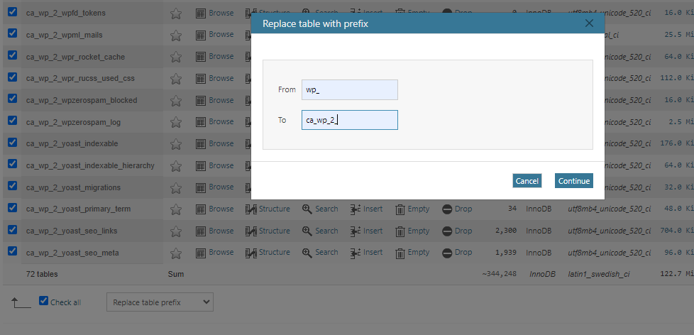

# Change defaut wp_ prefix to something more complex

🔺 Attention, bien vérifier le préfix des tables avant de lancer la commande 🔺
🔺 Attention BIS , bien sauvegarder la BDD avant de la manipuler 🔺

## Premiere étape:
### Option 1: via phpmyadmin
 Plus simple et plus rapide.


#### On selectionne toutes les tables, on choisis " Replace table prefix" et on renseigne les champs.

### Option 2: En SQL
Il faut récupérer la liste de toutes les tables présentes puis de lancer la commande :
```sql
RENAME table OLDPREFIX_options to NEWPREFIX_options;
```
Répeter pour chaque table.

### Deuxième étape:

Une fois le prefix changé, il faut indiquer le changement aux tables.

```sql
UPDATE NEWPREFIX_usermeta SET meta_key = 'NEWPREFIX_capabilities' WHERE meta_key = 'OLDPREFIX_capabilities';
UPDATE NEWPREFIX_usermeta SET meta_key = 'NEWPREFIX_user_level' WHERE meta_key = 'OLDPREFIX_user_level';
UPDATE NEWPREFIX_usermeta SET meta_key = 'NEWPREFIX_autosave_draft_ids' WHERE meta_key = 'OLDPREFIX_autosave_draft_ids';
UPDATE NEWPREFIX_options SET option_name = 'NEWPREFIX_user_roles' WHERE option_name = 'OLDPREFIX_user_roles';
```

